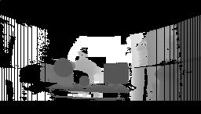
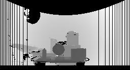

# Pattern recognition in 3D point clouds using 2D lidar

This project is my master's thesis, successfully defended in 2017. Full text with detailed charts, images, algorythms and dataflow diagrams is attached, but only in Russian.

## General idea
Let's assume that we have 2D lidar, which allows to get distance to obstacles only in one plane, but we want to make full 3D point cloud. This goal can be achieved if we perform scan in one plane, then turn lidar a little and perform another scan, and so on. As a result we will get an array of values in spherical coordinate system, each value represents distance to obstacle with two angles between the obstacle and center of lidar and horizon respectfully. We can see something like that:

This image is shifted a little to reveal volume. Each yellow dot is a single lidar measurement.

As a raw point cloud this information is not very valuable. What could be extracted from it? We can try to find some patterns, basic geometric shapes, for example.Raw point cloud is converted to a monochrome image (depth map) by projection to a plane, where intensity of each pixel represents distance to an obstacle.  

  

Then we can apply any pattern recognition algorythm. I used the next steps to discover basic shapes:
1. Segmentation of the image by applying pixel intensity thresholds. It produces binary images. Because intensity represents distance to an obstacle, we can select objects in foreground or background changing thresholds.
2. Removing too small fragments and applying mathematical morphology.
3. Applying Canny edge detector.
4. Discovering shapes by representing edges in Freeman chain code and calculating compactness measure of a shape.
Result is coordinates of a center and radius for circles, coordinates of corners for a rectangle. 

Example:  
  

Figures on the same image but on the different distance range (defferent values of thershold on the segmentation step):  
  
  
